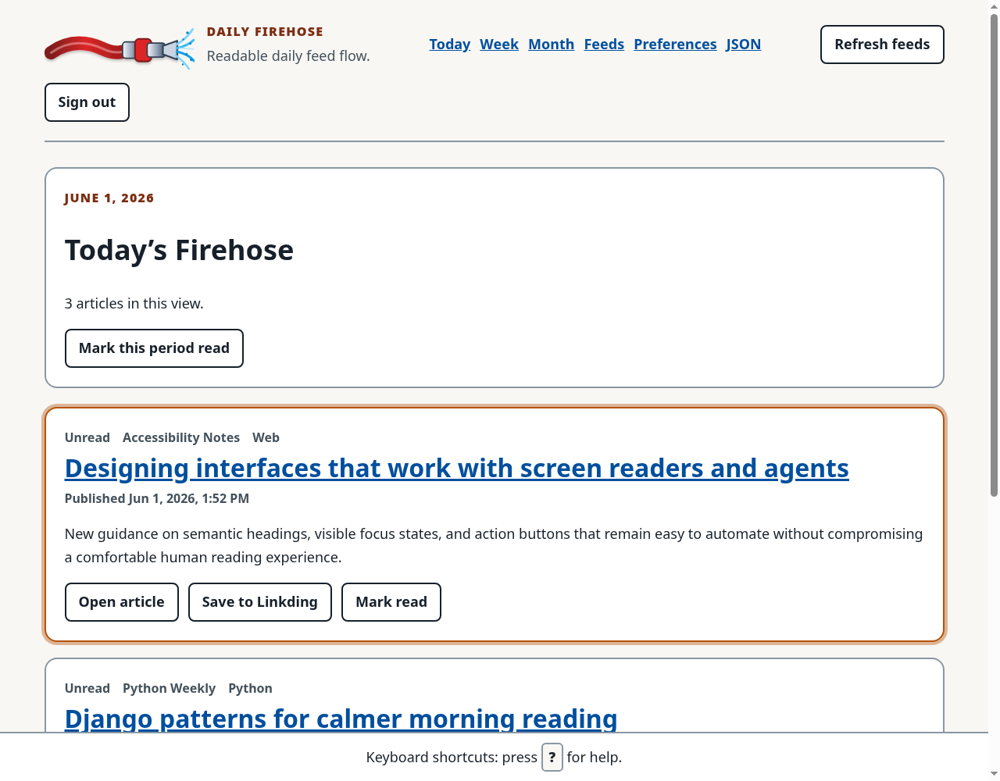

# Daily Firehose

Daily Firehose is a personal, accessible Django RSS reader for daily information flow.

## Screenshot



## Goals

- Show Today’s Firehose, plus week/month/feed views.
- Keep readability and WCAG AA accessibility central.
- Support Django auth, spacious article cards, keyboard-friendly controls, and high-contrast themes.
- Import and export feed subscriptions as OPML.
- Save articles to Linkding and track local saved-article metadata for future recommendations.
- Expose agent-friendly digest JSON.

## Local setup with uv

```bash
cd ~/src/personal/daily-firehose
uv sync
uv run python manage.py migrate
uv run python manage.py createsuperuser
uv run python manage.py runserver
```

Open <http://127.0.0.1:8000/> and sign in.

### Tests, including Playwright

Install the locked development dependencies and Chromium once per environment:

```bash
uv sync --dev
uv run playwright install chromium
```

On a clean Ubuntu CI runner, install Chromium and its system packages with:

```bash
uv run playwright install --with-deps chromium
```

Run the complete Django suite with `uv run python manage.py test feeds`. Browser
screenshots and DOM snapshots are written to the ignored
`test-artifacts/playwright/` directory only when a browser assertion fails
(including a documented expected-failure characterization).

## Docker Compose setup

The compose stack includes the Django web app, PostgreSQL, and a simple feed-refresh loop.

```bash
cp .env.example .env
# Edit .env, especially DJANGO_SECRET_KEY and LINKDING_TOKEN.
docker compose up --build
```

Create a superuser in the running web container:

```bash
docker compose exec web python manage.py createsuperuser
```

Open <http://127.0.0.1:8000/> and sign in.

### Production configuration and preflight

Canonical Compose defaults application services to fail-closed `production` so
starting without `.env` cannot expose development mode. `.env.example`
explicitly opts into `development` for local Compose. A production `.env` must
set every value below rather than inherit development placeholders:

```dotenv
DJANGO_ENV=production
DJANGO_DEBUG=false
DJANGO_SECRET_KEY=<a unique high-entropy value of at least 50 characters>
DJANGO_ALLOWED_HOSTS=daily-firehose.reedfish-regulus.ts.net
DJANGO_CSRF_TRUSTED_ORIGINS=https://daily-firehose.reedfish-regulus.ts.net
POSTGRES_DB=daily_firehose
POSTGRES_USER=daily_firehose
POSTGRES_PASSWORD=<a non-development database password>
POSTGRES_HOST=db
POSTGRES_PORT=5432
```

Generate a Django secret without committing it, for example with
`uv run python -c 'import secrets; print(secrets.token_urlsafe(64))'`. Compose
passes PostgreSQL fields separately, so reserved characters such as `%`, `@`,
`/`, and `:` are not reinterpreted as URL syntax.

For the existing production volume, preserve its stored database credential:
the current password is already a non-default 43-character URL-safe value, so
this deployment does **not** require rotation. Merely changing
`POSTGRES_PASSWORD` in `.env` does not change the role password stored in the
volume. Start only PostgreSQL, then run both the configuration check and a real
connectivity probe before restarting the application:

```bash
docker compose up -d db
docker compose run --rm --no-deps --build web \
  python manage.py check --deploy --fail-level WARNING
docker compose run --rm --no-deps web python manage.py shell -c \
  "from django.db import connection; connection.ensure_connection(); print('database connection ok')"
```

The probe detects a stored-role/`.env` mismatch. If it fails authentication, do
not remove the volume and do not start the full stack. Restore the last working
`.env` password, or deliberately rotate the stored role interactively without
placing a password in shell history:

```bash
docker compose exec db sh -c 'psql -U "$POSTGRES_USER" -d "$POSTGRES_DB"'
```

At the `psql` prompt run `\password <database-role>`, enter the new value twice,
then `\q`; update `.env` to the same value and rerun the connectivity probe.
Never pass the password with `-c`, print it, or delete `postgres-data` during
recovery.

Production startup rejects debug mode, missing or development secrets,
malformed/non-DNS/IP host entries, non-exact HTTPS CSRF origins, incomplete
PostgreSQL fields, and the documented development database password. An
explicit `DATABASE_URL` remains supported for non-Compose deployments and must
be a complete PostgreSQL URL in production. Errors name invalid variables but
never echo their values.

Gunicorn listens on `0.0.0.0` inside the web container, while Docker publishes
port 8000 only on host loopback. The verified Tailscale Funnel path terminates
TLS and proxies to that port with `X-Forwarded-Proto: https`. Django trusts only
that scheme header, redirects direct HTTP to HTTPS, and marks session and CSRF
cookies secure. The refresh worker waits for the web healthcheck, which becomes
healthy only after migrations finish and Gunicorn starts listening.

HSTS remains explicitly disabled (`SECURE_HSTS_SECONDS=0`) until an operator
confirms a staged rollout will not lock out recovery paths. Only deploy-check
warning `security.W004` is silenced for that documented decision; the preflight
above fails on every other warning.

For an application-code rollback, check out the last known-good revision and run
`docker compose up -d --build`; preserve `.env` and all volumes. Compose normally
recreates only changed application services and leaves the unchanged `db`
container running. Code rollback does not automatically reverse schema changes:
use a migration-specific, verified reverse migration when safe, or restore a
known-good database backup.

## Configuration

Environment variables:

- `DJANGO_ENV` — exactly `development` or `production`. Direct uv defaults to development; canonical Compose defaults to production, while `.env.example` explicitly selects development.
- `DJANGO_SECRET_KEY` — optional development value; required, strong, and non-default in production.
- `DJANGO_DEBUG` — strictly parsed boolean, defaulting to `true` only for development; must be `false` in production.
- `DJANGO_ALLOWED_HOSTS` — comma-separated host list. Local defaults are supplied only in development; production requires explicit public hostnames.
- `DJANGO_CSRF_TRUSTED_ORIGINS` — comma-separated origins. Production requires explicit HTTPS origins whose hostnames are allowed.
- `POSTGRES_DB`, `POSTGRES_USER`, `POSTGRES_PASSWORD`, `POSTGRES_HOST`, and `POSTGRES_PORT` — discrete PostgreSQL connection fields used by Compose. Partial values fail startup; production rejects missing fields and the development password.
- `DATABASE_URL` — optional alternative for non-Compose deployments. Direct uv development uses SQLite when neither it nor discrete PostgreSQL fields are set; production accepts only a complete PostgreSQL URL with a non-development password.
- `LINKDING_URL` — defaults to `https://linkding.reedfish-regulus.ts.net`.
- `LINKDING_TOKEN` — API token used by **Save to Linkding**.
- `FEED_FETCH_CONNECT_TIMEOUT_SECONDS` — feed connection timeout, default `5`.
- `FEED_FETCH_READ_TIMEOUT_SECONDS` — maximum socket inactivity while reading a feed, default `20`.
- `FEED_FETCH_TOTAL_TIMEOUT_SECONDS` — deadline checked before requests and between chunks, default `60`.
- `FEED_FETCH_MAX_BYTES` — maximum identity-encoded feed response size, default `5000000`.
- `FEED_FETCH_MAX_REDIRECTS` — maximum redirects per feed request, default `3`.

## Feeds and OPML

Feeds can be added from the **Feeds** page or from Django admin.

OPML support:

- Import: `/opml/import/`
- Export: `/opml/export/`

## Refreshing feeds

Run the management command manually or from cron/systemd:

```bash
uv run python manage.py refresh_feeds
```

Feed refresh and metadata discovery use the same bounded downloader. It accepts
only credential-free HTTP(S) URLs on ports 80 and 443, rejects every non-global
network target (including redirect destinations), requests identity encoding,
and limits redirects and downloaded bytes. Separate connect/read timeouts apply;
the total deadline is checked before requests and between response chunks.

The total deadline is not a hard wall-clock interrupt: a socket operation may
run until its read timeout, and an adversarial slow-drip response can exploit
the interval between checks. Network-level egress controls plus a process-level
watchdog or explicit minimum-rate enforcement are required to close that gap
and the DNS-validation/request DNS-rebinding interval completely.

For each active feed, metadata, article, and success-state writes commit in one
atomic database transaction. A failed article write rolls back that transaction
without aborting later feeds. Attempt state is recorded before network work, and
classified failure state is recorded after rollback, so both intentionally
persist outside the content transaction. Operational state is retained on
`Feed`: `last_attempt_at`, safe error code/message,
consecutive failures, and `next_retry_at`. `last_fetched_at` is the authoritative
last-success timestamp and changes only after all feed metadata and article
writes commit successfully. Failures use exponential backoff starting at five
minutes and capped at 24 hours; skipped feeds remain visible in command, browser,
and API summaries. Refresh completion logs include safe bounded feed identity,
status, duration, write counts or error code, failure count, and retry time. The
management command logs unexpected exceptions with tracebacks while returning
only classified safe messages to users. In the refresh API, `checked` remains
the total number of result rows, including backoff skips, while `attempted`
counts only feeds for which a refresh was attempted during that request.

## Saved articles

When an article is saved, Daily Firehose records the article URL, title, feed, category, timestamp, and Linkding status locally. This preserves a history that can later be used to highlight articles likely to be interesting.

## Agent-friendly API

Create a bearer token for an agent or other program:

```bash
uv run python manage.py create_api_token <username> --name morning-agent
```

Use it with `Authorization: Bearer <token>` (or `Token <token>`) against
`/api/v1/` endpoints. Every nonempty JSON request body must use
`application/json` or an `application/*+json` media type and contain a UTF-8 JSON
object. Nonstandard numeric constants (`NaN` and positive/negative `Infinity`) are
malformed JSON. Fields are typed strictly: JSON booleans are `true`/`false`, not
strings or numbers; missing, `null`, and a value of the wrong type are distinct.
Unknown or repeated query parameters and unknown JSON fields are rejected. This
is an intentional compatibility tightening: clients must stop sending ignored
parameters. Bodyless GET, DELETE, refresh, and feed-mark operations reject any
semantic request body; legacy zero-field multipart bodies remain accepted.

### Endpoints and input contracts

- `GET /api/v1/briefing/morning/` — today's unread, unsaved articles plus action
  URL templates.
- `GET /api/v1/articles/` — article list. `period` is `today`, `week`, or `month`.
  `start=YYYY-MM-DD` and `end=YYYY-MM-DD` must be supplied together and ordered.
  Optional `feed_id` is a positive integer. `include_read` and `include_saved`
  accept the lowercase query values `true` or `false` only.
- `POST` or `PATCH /api/v1/articles/<id>/read/` — optional
  `{"is_read": true}`; an omitted field preserves the legacy default of `true`.
- `POST` or `PATCH /api/v1/articles/<id>/saved/` — optional
  `{"is_saved": true, "notes": "...", "interest_score": 4.5}`. `saved` is a
  compatibility alias for `is_saved`, but both cannot be sent together.
  `interest_score` is nullable and otherwise must be a finite number from 0 to 5
  inclusive. `DELETE` the same URL to unsave locally. Unsave responses preserve
  the article's independent read state.
- `POST /api/v1/mark-period-read/` — `scope` is `day`, `week`, or `month`.
  Optional `period_start` and `period_end` ISO dates must be supplied together and
  ordered.
- `GET` or `POST /api/v1/feeds/` — list feeds or create/update one by its unique
  `feed_url`. Write fields are `feed_url`, `title`, `site_url`, `description`,
  nullable positive-integer `category_id`, and boolean `is_active`.
- `GET`, `PATCH`, or `DELETE /api/v1/feeds/<id>/` — inspect, update, or deactivate
  a feed. `POST /api/v1/feeds/<id>/mark-read/` marks that feed read.
- `GET` or `POST /api/v1/categories/` — list or create a category with string
  `name` and `slug` fields.
- `GET` or `PATCH /api/v1/preferences/` — inspect or update `theme`, boolean
  `compact`, and boolean `focus_mode`. Theme values are the values exposed by the
  preferences UI (for example `system`, `light`, `dark`, or `dracula`).
- `POST /api/v1/refresh/` — refresh feeds and return succeeded, failed, and
  backoff-skipped outcomes.

`feed_url` and nonblank `site_url` values must be credential-free HTTP(S) URLs.
Django model length, slug, choice, and URL validation runs before writes. A create request for
an already-identical category or feed retains its documented idempotent success;
a conflicting unique value returns `409`.

Every article representation includes additive per-article `capabilities` and
`actions`. Clients must honor `capabilities.save.allowed` and use the per-article
`actions` object rather than assuming every top-level action template applies.
Ordinary RSS articles advertise save and mark-read actions. Newsletter-backed
articles retain Open/Read and mark-read actions, but omit save and report
`save_not_allowed` because newsletters cannot be saved locally or sent to
Linkding. The morning briefing retains its top-level action templates only for
backward compatibility.

Signed browser-agent actions remain:

- `GET /api/v1/articles/<id>/save-and-go/?sig=...`
- `GET /api/v1/mark-period-read-and-go/?scope=day&sig=...`

A valid signed action returns `302` on success. Invalid signatures return `403`
before query/semantic validation, a valid signature with an invalid scope returns
`422`, and missing agent-link configuration returns `503 not_configured`.
Newsletter save attempts through bearer or signed APIs return
`422 save_not_allowed`; session form/AJAX attempts keep the card visible and show
a safe explanation.

Postmark delivers to `POST /api/postmark/inbound/<secret>/`. Secret authentication
runs before body/query validation. Expected input/model conflicts use the same
`400`, `422`, and `409` envelopes described below. The separate tracked Postmark
atomicity task still owns rollback and race-idempotency: this error mapping does
not claim that a failed ingestion has rolled back every write.

The older authenticated-session digest remains at `/api/digest/today.json`.

### Error contract

API errors use one envelope; semantic/model errors may include field details:

```json
{
  "error": {
    "code": "validation_error",
    "message": "Request fields failed validation.",
    "fields": {"feed_url": ["Enter a valid URL."]}
  }
}
```

- `400 bad_request` — malformed/non-object JSON, invalid UTF-8, nonstandard numeric
  constants, invalid media types, forbidden bodies, missing fields, wrong JSON
  types, incomplete date pairs, repeated parameters, or unknown inputs.
- `401 unauthorized` / `403 forbidden` — missing/invalid credentials or signed
  action authorization.
- `404 not_found` — an article, feed, or category does not exist.
- `405 method_not_allowed` — the endpoint does not support the HTTP method.
- `409 conflict` — a uniqueness or concurrent state conflict.
- `422 validation_error` — a well-typed value violates URL, date ordering, choice,
  range, slug, or Django model validation.
- `503 not_configured` — a signed action's server-side agent identity is absent.

Feed metadata discovery failures retain their stable transport code (for example
`timeout` or `http_failure`) inside the same envelope with HTTP `400`. The
application maps all expected authentication, request-validation, lookup,
model-validation, and uniqueness failures above to JSON. Unforeseeable programming
errors, process failures, or database/network outages may still reach Django's
`500` handling and are not claimed to be part of this API error contract.
