# Daily Firehose current-state architecture

> Snapshot: commit [`a0c62da2913078e0ac0e9e0fe1cfdd69e51a7823`](https://github.com/feoh/daily-firehose/tree/a0c62da2913078e0ac0e9e0fe1cfdd69e51a7823), committed 2026-08-11. This inventory describes repository state at that commit, not a target architecture.

## 1. Scope, evidence, and notation

This document inventories the first-party Django application, its browser and JSON adapters, persistence, external integrations, tests, and repository-defined production topology. It includes Django auth/admin where they cross a first-party boundary, but it does not reproduce framework-internal route tables or tables. Current-state claims come from tracked repository evidence or the explicitly dated, bounded production observation in section 9; no unobserved host configuration, monitoring, backup, or secret is inferred.

Published evidence is the tracked application source, migrations, tests, runtime manifests, and operator documentation linked below. Claims were checked against those files at the snapshot hash above; that commit is the immutable evidence pin, while relative links support reading the same paths in a checkout. Session-local or ignored reconnaissance artifacts are deliberately not cited.

Notation used throughout:

- **[F] Fact** — directly evidenced current behavior or structure.
- **[D] Known defect** — current behavior contradicted by an expected contract, regression characterization, or a demonstrated safety/correctness gap.
- **[I] Inference** — a consequence strongly implied by facts but not observed live.
- **[U] Unknown** — not established by repository evidence.
- **[R] Recommendation** — future work only; it does **not** exist today.

Cross-cutting tracked evidence includes [`README.md`](../../README.md), [`AGENTS.md`](../../AGENTS.md), the historical [2026-08-11 ingestion incident](../incidents/2026-08-11-mobile-today-empty.md), the executable topology in [`docker-compose.yml`](../../docker-compose.yml), and the regression contracts in [`feeds/tests/`](../../feeds/tests/). The post-snapshot [current-suite test traceability matrix](../features/test-traceability.md) reviews live evidence without changing this inventory's pinned claims or counts.

## 2. System summary

**[F]** Daily Firehose is one Django project with one first-party app, `feeds`. Gunicorn serves server-rendered pages, a progressive-enhancement JavaScript controller, a session JSON digest, a capability-scoped bearer-token JSON API, single-use signed actions, a Postmark webhook, and Django admin. A separate Compose container repeatedly invokes the same Django feed-refresh command. Both application processes share one PostgreSQL database. See [`daily_firehose/urls.py`](../../daily_firehose/urls.py), [`feeds/urls.py`](../../feeds/urls.py), and [`docker-compose.yml`](../../docker-compose.yml).

**[F]** Articles from RSS/Atom and email newsletters converge on `Article`. A reverse one-to-one `NewsletterIssue` distinguishes newsletter-backed articles. Per-user read state and saved state are stored separately. See [`feeds/models.py`](../../feeds/models.py).

### System context

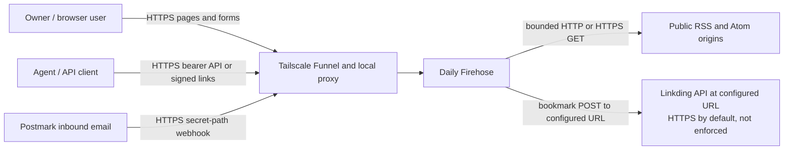

### Container view

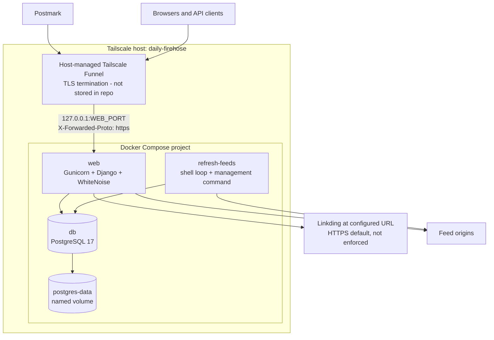

## 3. Component and module inventory

### Runtime Python and schema

| Component/module | Current responsibility and important dependencies |
| --- | --- |
| [`manage.py`](../../manage.py) | **[F]** Django CLI bootstrap; sets `DJANGO_SETTINGS_MODULE` and calls Django command dispatch. |
| `daily_firehose/__init__.py` | **[F]** Empty package marker. |
| [`daily_firehose/settings.py`](../../daily_firehose/settings.py) | **[F]** Environment parsing, strict production validation, DB selection, middleware/templates/static/auth settings, proxy/cookie controls, integrations, fetch bounds, and refresh logger. Depends on `dj-database-url` and Django settings contracts. |
| [`daily_firehose/urls.py`](../../daily_firehose/urls.py) | **[F]** Mounts `feeds.urls` at `/`, Django login/logout, and Django admin. |
| [`daily_firehose/wsgi.py`](../../daily_firehose/wsgi.py) | **[F]** WSGI export used by Gunicorn. |
| [`daily_firehose/asgi.py`](../../daily_firehose/asgi.py) | **[F]** ASGI export; no repository runtime invokes it. |
| `feeds/__init__.py` | **[F]** Empty app package marker. |
| [`feeds/apps.py`](../../feeds/apps.py) | **[F]** Declares `FeedsConfig`. |
| [`feeds/models.py`](../../feeds/models.py) | **[F]** All nine application-owned persistent models, `ReadScope`, constraints, ordering, token hashing/generation. Depends on Django ORM and configured auth user. |
| [`feeds/forms.py`](../../feeds/forms.py) | **[F]** `FeedForm`, uploaded-file `OPMLImportForm`, and `ThemeForm`. |
| [`feeds/feed_fetch.py`](../../feeds/feed_fetch.py) | **[F]** Application-owned outbound feed transport. Validates URL, port and all resolved addresses at each redirect; disables environment proxies; bounds redirects, bytes, connect/read time, and a cooperative total deadline; maps failures to safe codes. Uses Requests, urllib3 exceptions, DNS, and settings. |
| [`feeds/services.py`](../../feeds/services.py) | **[F]** Application/integration layer: save capability policy; feed parse/refresh/backoff/logging; newsletter import/archive URL/sanitization; feed discovery; OPML import/export; local save, Linkding delivery state machine, reconciliation, and drain. Uses ORM, `feed_fetch`, feedparser, Bleach, Requests, and XML parsing. |
| [`feeds/views.py`](../../feeds/views.py) | **[F]** Session/browser controllers and legacy digest JSON. Also owns shared period, visibility, read-state, card-query, and preference helpers. Uses forms, models, services, templates/messages. |
| [`feeds/api_validation.py`](../../feeds/api_validation.py) | **[F]** Strict primitive/query/body validation and normalized JSON problem responses. |
| [`feeds/api.py`](../../feeds/api.py) | **[F]** Postmark, signed-action and bearer-API adapters; authentication, capability enforcement, serializers, input mapping and exception mapping. Uses models, services, commands and validation. |
| [`feeds/urls.py`](../../feeds/urls.py) | **[F]** Complete first-party route registration. Dynamically imports `feeds.api` because API imports browser helpers. |
| [`feeds/admin.py`](../../feeds/admin.py) | **[F]** Registers all nine app models. List/search/filter/read-only configuration exposes refresh state and tokens. On create or Article reassignment only, `SavedArticleAdminForm` blocks selecting a newsletter article; normal admin persistence writes ORM state directly without the save service or Linkding, and non-admin ORM writes bypass the form check. |
| `feeds/migrations/__init__.py` | **[F]** Migration package marker. |
| `0001_initial.py` | **[F]** Initial Feed, Article, read-state, bulk-marker and preference schema. |
| `0002_category_feed_category_savedarticle.py` | **[F]** Adds Category, Feed.category and SavedArticle. |
| `0003_apitoken.py` | **[F]** Adds bearer-token persistence. |
| `0004_newsletterissue.py` | **[F]** Adds newsletter archive persistence. |
| `0005_alter_userpreference_theme.py` | **[F]** Expands theme choices. |
| `0006_userpreference_focus_mode.py` | **[F]** Adds focus mode. |
| `0007_feed_consecutive_failures_feed_last_attempt_at_and_more.py` | **[F]** Adds per-feed attempt/error/failure/backoff fields. |
| `feeds/management/__init__.py`, `feeds/management/commands/__init__.py` | **[F]** Django management package markers. |
| [`create_api_token.py`](../../feeds/management/commands/create_api_token.py) | **[F]** Deletes a user's same-named token, creates a replacement, and prints the raw token once. Missing user exits with `CommandError`. |
| [`refresh_feeds.py`](../../feeds/management/commands/refresh_feeds.py) | **[F]** Runs serial active-feed refresh and prints per-feed plus aggregate results. **[D]** It does not exit nonzero when feeds fail. |

### Templates and static frontend

| Asset | Current responsibility |
| --- | --- |
| [`templates/base.html`](../../templates/base.html) | **[F]** Page shell, theme/focus classes, navigation, refresh and logout forms, messages, keyboard-help dialog, static CSS/JS. |
| [`templates/feeds/digest.html`](../../templates/feeds/digest.html) | **[F]** Today/week/month/archive/saved shared heading, empty state, bulk-read form, and article-card loop. |
| [`templates/feeds/feed_detail.html`](../../templates/feeds/feed_detail.html) | **[F]** Feed-scoped article cards and mark-feed-read action. |
| [`templates/feeds/feed_list.html`](../../templates/feeds/feed_list.html) | **[F]** Feed create form, feed/category list, OPML navigation, and configured inbound email display. |
| [`templates/feeds/includes/article_card.html`](../../templates/feeds/includes/article_card.html) | **[F]** Reusable article/card data contract, open/read/unread/save controls. Newsletter cards use archive/read behavior and omit saving. |
| [`templates/feeds/newsletter_detail.html`](../../templates/feeds/newsletter_detail.html) | **[F]** Public issue archive with `noindex`, sanitized HTML or escaped text fallback, and authenticated read control. |
| [`templates/feeds/opml_import.html`](../../templates/feeds/opml_import.html) | **[F]** Multipart OPML upload UI. |
| [`templates/feeds/preferences.html`](../../templates/feeds/preferences.html) | **[F]** Theme, compact and focus-mode form. |
| [`templates/feeds/today.html`](../../templates/feeds/today.html) | **[D]** Apparently dead duplicate: no first-party render call targets it; Today renders `digest.html`. |
| [`templates/registration/login.html`](../../templates/registration/login.html) | **[F]** Django session login form. |
| [`static/js/article-actions.js`](../../static/js/article-actions.js) | **[F]** Card/feed selection, keyboard help/navigation, clipboard actions, refresh pending state, and AJAX mark/save submission with CSRF and message/card updates. |
| [`static/css/site.css`](../../static/css/site.css) | **[F]** Responsive layout, article cards, themes, focus/compact modes, controls and accessibility styling. |
| [`static/img/firehose-masthead.svg`](../../static/img/firehose-masthead.svg) | **[F]** Masthead artwork. |
| `staticfiles/` | **[F]** Ignored/untracked output path for `collectstatic`; the image build regenerates it. It is not source architecture. |

### Build, runtime, and operator artifacts

| Artifact | Current responsibility |
| --- | --- |
| [`Dockerfile`](../../Dockerfile) | **[F]** Builds the Python 3.12/uv production image, installs frozen non-dev dependencies, copies the Docker build context, collects static files, exposes 8000, and defaults to Gunicorn. |
| [`.dockerignore`](../../.dockerignore) | **[F]** Excludes Git metadata, local environments/databases/secrets, caches, generated static files, session artifacts, and `feeds/tests/` from the production image build context. Tests therefore do not ship in the canonical image. |
| [`docker-compose.yml`](../../docker-compose.yml) | **[F]** Executable three-service topology, environment pass-through, health/dependency ordering, loopback publication, refresh schedule, and persistent volume. |
| [`.env.example`](../../.env.example) | **[F]** Development/operator configuration-name template. It contains placeholders/default development values, not production secrets. |
| [`.gitignore`](../../.gitignore) | **[F]** Keeps local environments, databases, `.env`, generated static/browser artifacts, caches, and session artifacts out of version control. |
| [`.python-version`](../../.python-version) | **[F]** Selects Python 3.12 for local version managers, matching the image's Python line. |
| [`pyproject.toml`](../../pyproject.toml), [`uv.lock`](../../uv.lock) | **[F]** Runtime/dev dependency declarations and exact lock resolution; mypy/Django plugin settings. |
| [`.pre-commit-config.yaml`](../../.pre-commit-config.yaml) | **[F]** YAML/EOF/trailing-whitespace checks only. |
| [`README.md`](../../README.md), [`AGENTS.md`](../../AGENTS.md) | **[F]** Setup, API/behavior contracts, production preflight, canonical deployment/recovery and verification procedure. |
| [`docs/images/article-reading-view.png`](../images/article-reading-view.png) | **[F]** Tracked UI screenshot rendered by the README; documentation evidence, not a runtime asset. |
| [`PLAN.md`](../../PLAN.md) | **[F]** Historical Postmark implementation plan. Its newsletter features largely exist now; its remaining deployment/manual steps must not be treated as completed evidence. |
| [2026-08-11 ingestion incident](../incidents/2026-08-11-mobile-today-empty.md) | **[F]** Production failure evidence and corrective contract. Its direct-feedparser/per-feed-state description predates current fetch/backoff code; heartbeat requirements remain open. |

### Test inventory

| Test/support module | Contract protected |
| --- | --- |
| `feeds/tests/__init__.py`, `support/__init__.py` | Test/support package markers. |
| `feeds/tests/support/base.py` | Shared Django test base and common objects. |
| `support/builders.py` | Deterministic object/request data builders. |
| `support/http_responses.py` | Requests-compatible HTTP doubles. |
| `support/fixtures/*` | RSS, Atom, OPML, Postmark, Linkding and sanitizer attack samples. |
| `test_api.py` | Bearer resources, authentication and response contracts. |
| `test_api_validation.py` | JSON/media/query/type/error-envelope validation. |
| `test_article_actions.py` | Browser mark/save and JS-facing response behavior. |
| `test_article_state_propagation.py` | Cross-view read/save/bulk-state consistency. |
| `test_builders_and_fixtures.py` | Test builders and fixtures themselves. |
| `test_digest_views.py` | Today/week/month/archive/saved/feed digest behavior. |
| `test_feed_fetch.py` | URL/SSRF policy, redirects, size/time/network classification. |
| `test_feed_refresh.py` | Parsing, article writes, failure isolation, retry state and logging. |
| `test_feed_views.py` | Feed list/create/detail browser behavior. |
| `test_known_correctness_failures.py` | **[F]** Eight `expectedFailure` characterizations for known defects, including GUID/URL identity, malformed OPML atomicity, open redirects, newsletter atomicity, and bulk marker shape. A green suite therefore does not mean these defects are fixed. |
| `test_mobile_today_browser.py` | Playwright responsive Today behavior and discoverability. |
| `test_newsletter_save_policy.py` | Newsletter save prohibition across adapters/admin and cache freshness. |
| `test_newsletters.py` | Webhook, dedupe, archive and sanitization. |
| `test_opml.py` | Parent-category import and existing-Feed update behavior; it has no export test. |
| `test_production_settings.py` | Fail-closed environment/database/proxy/security settings. |

## 4. Route and adapter map

Legend: **session** means `login_required` and CSRF middleware protects mutations; **bearer** means an active `ApiToken` for an active user whose capabilities permit the request method, with CSRF exemption; **signed** means a single-use expiring HMAC capability in the query; **public-secret** means a secret path segment; **public** means no authentication. `GET*` or `GET/POST*` means those are intended paths, but the view has no explicit method decorator and may render the same response for other verbs. That permissiveness is current fact, not a recommendation.

### Framework-mounted routes

| Method | Path / name | Auth | Input → output | Command/service and side effects |
| --- | --- | --- | --- | --- |
| GET, HEAD, POST, PUT, OPTIONS | `/accounts/login/` / `login` | public | Django authentication form → HTML/redirect; HEAD delegates to GET, PUT dispatches the POST handler, and OPTIONS is framework-generated | Django 5.2 `LoginView`; successful POST creates an authenticated session. Other methods receive 405; listing PUT here records dispatch support, not a supported client login contract. |
| POST, OPTIONS | `/accounts/logout/` / `logout` | public; CSRF-protected | CSRF form → redirect to login | Django `LogoutView`; ends an existing session when present, while anonymous POST also redirects to login. |
| framework-defined | `/admin/**` | public login; staff/session for protected children | Django admin login/forms → HTML/redirect | Auth/admin child routes and CRUD for nine registered app models plus Django auth models. Exact children come from installed Django 5.x, not first-party URL declarations. |

### Browser, webhook, signed-link, and legacy routes

| Method | Path / name | Auth | Input → output | Command/service and side effects |
| --- | --- | --- | --- | --- |
| GET* | `/` / `today` | session | Current UTC-local date → `digest.html` | Reads articles by `fetched_at` date; creates default `UserPreference` if absent; hides effective-read and saved articles. `never_cache`. |
| GET* | `/week/` / `week` | session | Current Monday–Sunday → `digest.html` | Same reads/preference creation for week. |
| GET* | `/month/` / `month` | session | Current calendar month → `digest.html` | Same reads/preference creation for month. |
| GET* | `/archived/` / `archived` | session | None → latest 50 explicit-read cards | Reads `ArticleReadState`; preference may be created. Bulk-only history is absent unless explicit rows were materialized. |
| GET* | `/saved-links/` / `saved-links` | session | None → latest 50 saves | Reads saved snapshots/live articles and read state; preference may be created. |
| GET/POST* | `/feeds/` / `feeds` | session | `FeedForm`; blank title triggers remote discovery → HTML/redirect | Reads all feeds. Valid POST may call bounded feed fetch then insert Feed and message. |
| GET* | `/feeds/<feed_id>/` / `feed-detail` | session | Integer ID → first 100 model-ordered articles in HTML | Reads Feed/articles/state; preference may be created. |
| POST | `/feeds/<feed_id>/mark-read/` / `mark-feed-read` | session | ID and optional `next` → redirect | Materializes explicit read rows, then upserts feed marker. **[D]** No encompassing transaction; `next` is not same-origin validated. |
| GET* | `/newsletters/<public_id>/` / `newsletter-detail` | public | UUID → archive HTML or 404 | Reads issue/article; sanitizes stored HTML on every render; sets `X-Robots-Tag: noindex`. Authenticated access may create preferences and reads state. No open event is persisted. |
| GET/POST* | `/opml/import/` / `opml-import` | session | Multipart `opml_file` → HTML/redirect | Parses the complete XML tree before writes, then incrementally creates/updates Category/Feed. **[D]** Malformed XML escapes form handling as an error but cannot partially write; a later failure while processing valid XML can leave partial writes because there is no transaction. |
| GET* | `/opml/export/` / `opml-export` | session | None → OPML attachment | Reads active feeds; no write. |
| GET/POST* | `/preferences/` / `preferences` | session | `theme`, `compact`, `focus_mode` → HTML/redirect | Gets-or-creates then updates `UserPreference`. |
| POST | `/refresh/` / `refresh-feeds` | session | Optional `next` → redirect/messages | Synchronously refreshes every eligible active feed in request process. Per-feed DB/network side effects. **[D]** Untrusted redirect and long request. |
| POST | `/articles/<article_id>/mark/` / `mark-article` | session | `state` (`read` means true; anything else false), optional AJAX/removal/`next` → JSON or redirect | Upserts `ArticleReadState`. **[D]** Untrusted redirect. |
| POST | `/articles/<article_id>/save/` / `save-article` | session | Optional echoed ID/URL and AJAX/`next` → JSON or redirect | Verifies echoed identity; local save then synchronous Linkding POST; persists remote result. Newsletter save denied. **[D]** Untrusted redirect. |
| POST | `/mark-period-read/` / `mark-period-read` | session | Required scope/start/end strings and optional `next` → redirect | Materializes explicit rows then upserts period marker. **[D]** No validation guard/transaction; malformed fields can error; untrusted redirect. |
| GET* | `/api/digest/today.json` / `digest-json` | session | Method/query/body ignored by the view → legacy JSON digest | Reads unread/unsaved Today cards; no API-token auth and no standardized API error envelope. Django CSRF middleware rejects unsafe requests without a valid token; CSRF-valid unsafe methods reach the same method-agnostic view. |
| POST | `/api/postmark/inbound/<secret>/` / `postmark-inbound` | public-secret; CSRF exempt | No query; strict JSON object requiring only truthy MessageID → `{id, created}`, 200/201 or problem JSON | Constant-time path-secret check precedes validation. Other payload fields are optional/string-coerced and created models are not passed through `full_clean()`. Creates the synthetic Feed as inactive only when absent; an existing Feed is reused without changing its active state, then Article and NewsletterIssue are created. **[D]** The writes are not one transaction. |
| POST | `/api/v1/articles/<id>/save-and-go/` / `api-article-save-and-go` | signed | `expires`, `nonce`, `sig` query → external article redirect or problem JSON | **[F]** HMAC binds purpose, article ID, deadline, and nonce; single use, bounded lifetime; configured active username; local + Linkding save. GET returns 405. Redirect occurs even when Linkding failure was persisted. |
| POST | `/api/v1/mark-period-read-and-go/` / `api-mark-period-read-and-go` | signed | `scope` day/week/month (default day), `expires`, `nonce`, `sig` → Today redirect/problem JSON | **[F]** HMAC binds purpose, scope, deadline, and nonce; single use, bounded lifetime; resolves current period at use time; atomically materializes rows and marker. GET returns 405. The same scope still targets a changing period, which the short lifetime bounds. |

### Bearer JSON API

All rows are CSRF-exempt. Authentication hashes the supplied Bearer/Token key, selects an active token whose user is active, and updates `last_used_at` **before** the endpoint runs. Strict JSON endpoints reject duplicate/unknown fields, non-object or invalid UTF-8 JSON, nonstandard numbers, and unsupported media types. Unless shown, query parameters and semantic bodies are rejected. Expected errors use the documented `error.code/message[/fields]` envelope; unanticipated process, DB, and network failures may be 500s.

| Method | Path / name | Input → output | Command/service and side effects |
| --- | --- | --- | --- |
| GET | `/api/v1/briefing/morning/` / `api-morning-briefing` | Empty body/query → Today unread/unsaved article representations and legacy action templates | Reads articles/state/capabilities; no endpoint write beyond the authentication-time token `last_used_at`. |
| GET | `/api/v1/articles/` / `api-articles` | `period=today\|week\|month`, or ordered`start` + `end`; optional positive`feed_id`,`include_read`,`include_saved` → unpaginated article list | Reads articles, feed/category, newsletter capability, read markers/states and saves. Arbitrary date windows have no configured cap. |
| POST, PATCH | `/api/v1/articles/<id>/read/` / `api-article-read` | Optional JSON boolean `is_read` (default true) → article representation | Validates then upserts `ArticleReadState`; no explicit transaction. |
| POST, PATCH | `/api/v1/articles/<id>/saved/` / `api-article-saved` | `is_saved` or alias `saved`; optional notes and nullable 0–5 finite score → save + article representation | Save true validates local object, performs local save + Linkding, then separately updates notes/score. Save false deletes local row only. **[D]** Metadata phase is not atomic with save/external call. |
| DELETE | same / `api-article-saved` | Empty body → unsaved article representation | Deletes local `SavedArticle`, cascading its delivery so an owed bookmark is cancelled; an already-delivered Linkding bookmark is not deleted. |
| POST | `/api/v1/mark-period-read/` / `api-mark-period-read` | Scope and optional ordered date pair → marked scope/dates | In one DB transaction materializes explicit rows and upserts period marker. |
| GET | `/api/v1/feeds/` / `api-feeds` | Empty body/query → all feeds | Read only apart from token timestamp. |
| POST | same / `api-feeds` | Required HTTP(S) `feed_url`; optional title/site/description/category/is_active → feed and created flag | If title absent, synchronously discovers metadata. Creates or updates by unique URL after validation. |
| GET | `/api/v1/feeds/<id>/` / `api-feed-detail` | Empty body/query → feed | Read only apart from token timestamp. |
| PATCH | same / `api-feed-detail` | Any allowed feed fields → feed | Validates category/URLs/uniqueness and updates Feed. |
| DELETE | same / `api-feed-detail` | Empty body → feed | Soft-deactivates Feed (`is_active=false`); does not delete articles. |
| POST | `/api/v1/feeds/<id>/mark-read/` / `api-feed-mark-read` | Empty body/query → marked feed | Atomically materializes explicit rows and upserts feed marker. |
| GET | `/api/v1/categories/` / `api-categories` | Empty body/query → all categories | Read only apart from token timestamp. |
| POST | same / `api-categories` | Required name/slug → category + created flag | Idempotent for matching slug/name; otherwise inserts or returns conflict. |
| GET | `/api/v1/preferences/` / `api-preferences` | Empty body/query → preference | Gets-or-creates `UserPreference`. |
| PATCH | same / `api-preferences` | Optional valid theme/compact/focus_mode → preference | Gets-or-creates, validates, updates. |
| POST | `/api/v1/refresh/` / `api-refresh` | Empty body/query → per-feed/aggregate result JSON | Synchronously refreshes all eligible active feeds; returns 200 even when result rows contain feed failures. |

## 5. Dependency directions

### Intended/current dependency graph

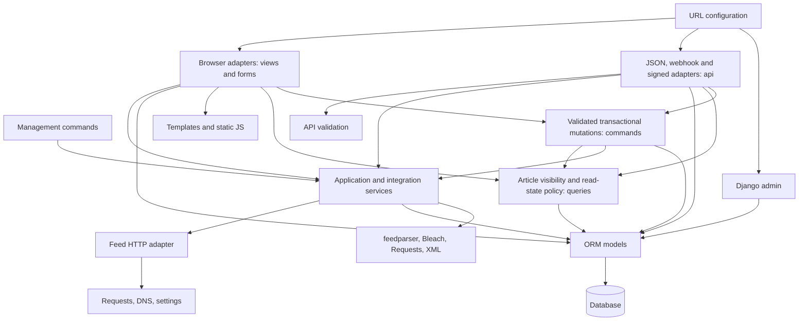

**[F]** Normal direction is adapter → application service/query → ORM/integration. Browser JS submits routes embedded by templates. CLI commands call services/models. Admin usually writes ORM directly.

**[F] Resolved layering.** Article visibility, read-state resolution, period bounds, and preference lookup live in [`feeds/queries.py`](../../feeds/queries.py), which both [`feeds/views.py`](../../feeds/views.py) and [`feeds/api.py`](../../feeds/api.py) consume. The API no longer imports private helpers from the presentation adapter, so [`feeds/urls.py`](../../feeds/urls.py) imports both modules directly instead of deferring the API import to break a cycle.

**[F] Shared mutation commands.** Read-state mutation and refresh orchestration live in [`feeds/commands.py`](../../feeds/commands.py). Marking an article, a period, or a Feed read, and tallying a refresh, each have exactly one implementation that the session, bearer, and signed-link adapters call. A command validates the marker shape and commits explicit-state materialization together with the marker upsert, so the session surface no longer differs from the other two in atomicity, validation, or counts. Adapters retain only their own wire-format parsing and error rendering.

**[D] Remaining policy spread.** Save metadata, Feed/Category creation, and preference updates are still written directly by each adapter, with Django forms validating the browser path and `api_validation` validating the JSON path. Admin writes bypass service commands entirely. Splitting the external Linkding gateway from pure domain state is tracked separately.

## 6. Persistence model

### Complete application ERD

`AUTH_USER_MODEL` is a Django-owned table shown only as the external parent. All application models use implicit `BigAutoField id` primary keys. Cardinality is from database foreign keys; nullable relationships are marked optional.

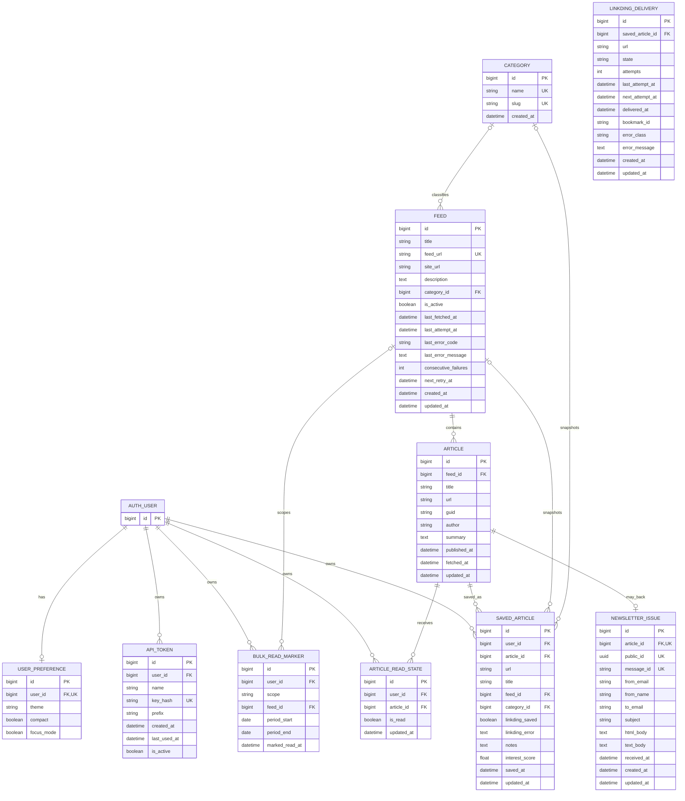

### Model semantics, keys, deletion, ordering, and time

| Model | Constraints and defaults | Deletion/cardinality | Ordering and timestamp semantics |
| --- | --- | --- | --- |
| `Category` | `name` unique max 120; `slug` unique max 140. | A Category has 0..n Feeds and SavedArticle snapshots; deletion sets both nullable FKs to null. | Default `name`; `created_at` set once on insert. |
| `Feed` | `feed_url` unique URL max 200; title max 255; blank site URL max 200 and description; active true; blank error code max 64/message; failures nonnegative; health times nullable. | Optional Category; deleting Feed cascades Articles, their dependent NewsletterIssues/SavedArticles/read states, and feed-scoped markers. A surviving SavedArticle whose independent snapshot FK references the deleted Feed gets that snapshot FK set null. | `(title, feed_url)`; `created_at` insert; `updated_at` each model save; attempts/success/retry have service-defined meanings. |
| `Article` | Composite unique `(feed,guid)` and `(feed,url)`; required title max 500, URL/GUID max 1000; author max 255 and summary may be blank; publication defaults now. | Exactly one Feed; deleting Feed cascades Articles; deleting Article cascades its issue, saves, and read states. | `(-published_at,title)`; `fetched_at` insert time; `updated_at` model save time. Bulk update paths require explicit timestamps. |
| `NewsletterIssue` | `article`, `public_id`, `message_id` (max 1000) each unique; UUID generated and non-editable; subject max 500; email fields use Django EmailField limits, sender name max 255; bodies/addresses may be blank. | Exactly one Article, at most one issue per Article; Article deletion cascades issue. | `(-received_at,subject)`; `received_at` payload date or now; `created_at` insert; `updated_at` save. |
| `SavedArticle` | Composite unique `(user,article)`; required denormalized URL max 1000/title max 500; `linkding_saved=false`, error/notes blank; score nullable with no DB range check. | Required User and Article cascade; optional Feed/Category snapshots set null. | `-saved_at`; `saved_at` first insert and does not change on re-save; `updated_at` save. |
| `LinkdingDelivery` | One per SavedArticle; state one of queued/succeeded/transient_failed/permanent_failed with check constraints tying delivered/scheduled timestamps and a non-empty error class to the state; attempts nonnegative; URL max 1000; bookmark id max 64. | Exactly one SavedArticle; deleting the save cascades the delivery, which is how unsave cancels an owed bookmark. | Indexed by `(state,next_attempt_at)` for the drain; `created_at` insert; `updated_at` save. |
| `ArticleReadState` | Composite unique `(user,article)`; `is_read=true` default. | User or Article deletion cascades. | No default ordering; `updated_at` changes on update/upsert. |
| `BulkReadMarker` | Scope max 10 with day/week/month/feed choices; nominal composite unique `(user,scope,feed,period_start,period_end)`; all scope-detail columns nullable. | User deletion cascades; optional Feed deletion cascades marker. | `-marked_read_at`; `auto_now_add` sets insert time, while current `update_or_create` paths explicitly replace the timestamp on an existing marker. |
| `ApiToken` | Globally unique SHA-256 `key_hash` max 64; name max 120; composite unique `(user,name)`; prefix max 12; active true. Raw token is generated from 32 URL-safe bytes, returned once and never stored. | User deletion cascades tokens. | `-created_at`; created once; nullable `last_used_at` updates on successful authentication attempt. |
| `UserPreference` | User one-to-one; theme max 32/choice defaults `system`; compact/focus false. | User deletion cascades preference. | No timestamps or ordering. |

### Explicit data invariants and enforcement

| Invariant | DB enforcement | Application enforcement / gap |
| --- | --- | --- |
| Category name and slug are individually unique. | **[F]** Unique columns. | API prechecks idempotency/conflict; model/admin validation also applies. |
| Feed URL is globally unique. | **[F]** Unique column. | Browser model form and API validation; OPML uses `update_or_create`. |
| Article identity is unique by feed+GUID and independently feed+URL. | **[F]** Two DB unique constraints. | **[D]** Refresh reconciles only by feed+GUID, so changed GUID with same URL fails rather than updates. |
| One issue per Article; public UUID and Postmark message ID unique. | **[F]** One-to-one/unique columns. | Pre-query dedupe only. **[D]** non-atomic create can orphan Article and retry may collide. No DB rule forces a newsletter Article into the synthetic Feed. |
| One local save per user/article. | **[F]** Composite unique. | Save service refreshes snapshots and blocks newsletters using a fresh issue query. Snapshot equality with live Article/Feed/Category is application-only and can drift. |
| One explicit read state per user/article. | **[F]** Composite unique. | Conflict upsert materializes bulk reads. Explicit false always overrides effective bulk read. |
| Marker shape matches scope and logical marker is unique. | **[D]** Not actually enforced. No CHECK constraints; ordinary PostgreSQL unique permits duplicate NULL-shaped period/feed rows. | API validates basic values but not via a shared model invariant; admin/direct writes can create invalid shapes. Expected-failure tests pin this. |
| Period start is not after end. | No DB CHECK. | Token API validates ordering; session bulk view does not. |
| Interest score is null or 0..5 finite. | No DB CHECK. | Bearer API validator enforces; admin/direct writes and service do not establish same bound. |
| Token prefix corresponds to key/hash source. | No DB relation can prove it. | `create_token` constructs both consistently; direct writes can diverge. |
| Feed failure count is nonnegative. | Positive integer field check semantics. | Service increments under row lock; concurrent refresh success/failure status ownership remains uncoordinated. |
| Effective read is explicit true or applicable marker, minus explicit false. | Not materialized as DB constraint/view. | `queries.read_article_ids`; marker applies only when `article.fetched_at <= marked_read_at`; day matching uses local date of `fetched_at`. |
| Normal digest visibility excludes effective-read **and** locally saved articles. | Query/application only. | `queries.article_cards`; archived/saved views have separate presentation semantics. |

## 7. Runtime data flows and boundaries

### Feed discovery and refresh

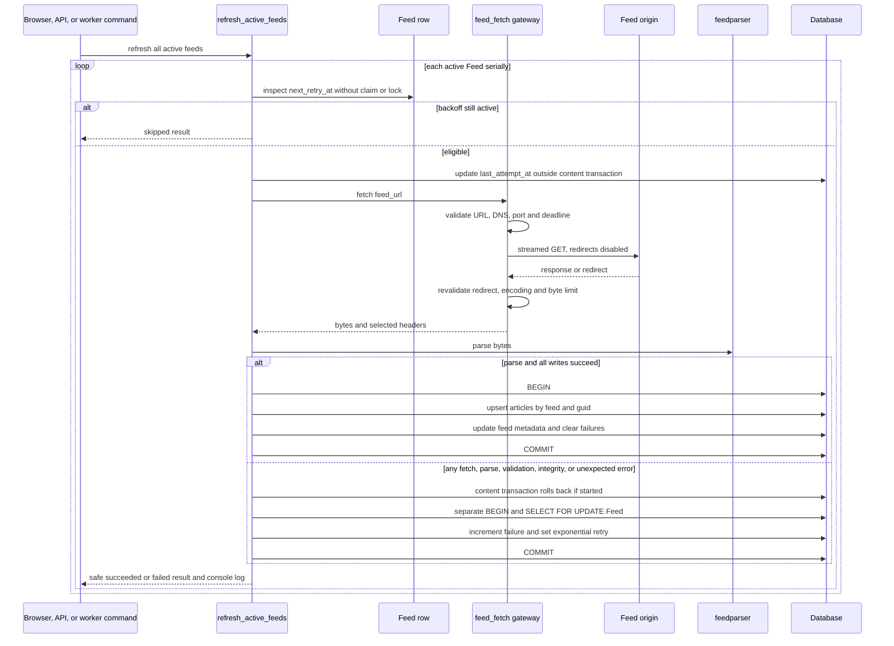

**[F] Transaction boundary.** Network and parse run outside a transaction. `last_attempt_at` commits before them. One content transaction covers all article and success/feed metadata writes for one feed. Failure recording runs in a separate atomic row-lock transaction after rollback. A failed feed does not stop later feeds.

**[F] Failure policy.** Fetch errors are classified; parse/model/integrity errors become safe codes; unexpected errors log a traceback. Retry starts at five minutes and doubles to a 24-hour cap. The worker then sleeps its fixed delay after the entire command completes.

**[D] Coordination boundary.** Worker, browser refresh and bearer refresh can overlap. Eligibility has no claim/lease; success does not lock/reload; only failure recording locks after network work. A later failure can overwrite concurrent success status.

**[D] Availability boundary.** Browser and bearer refresh execute serial external work synchronously in Gunicorn. Compose configures no worker count, so Gunicorn's default worker configuration applies.

### Article visibility, individual read, and bulk read

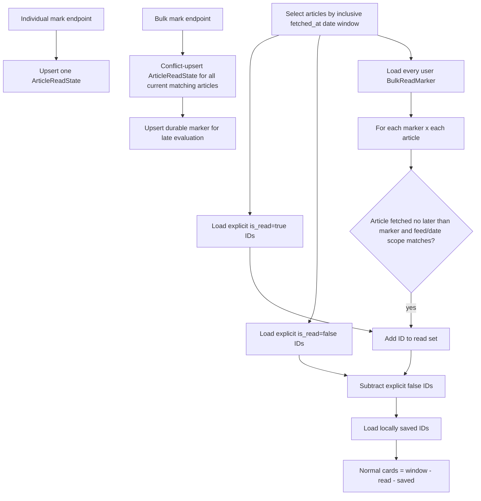

**[F]** Scope is based on `fetched_at`/its UTC-local date, not `published_at`. A marker does not mark an article fetched after the marker timestamp. Explicit unread is the final override. Bulk actions both materialize current explicit rows and retain markers.

**[F]** Every adapter marks read through one command in [`feeds/commands.py`](../../feeds/commands.py), so the materialization and the marker write commit or roll back together on the session, bearer, and signed paths alike.

**[F]** `queries.read_article_ids` resolves coverage in SQL. Markers are narrowed before they are read — by owner, by the oldest `fetched_at` on screen, by the feeds present, and by period overlap — so resolution cost tracks the window shown rather than the reader's whole marking history. `fetched_at`, `(feed, fetched_at)`, `(user, is_read, -updated_at)`, `(user, marked_read_at)`, and `(user, -saved_at)` indexes back these paths.

### Local save and Linkding

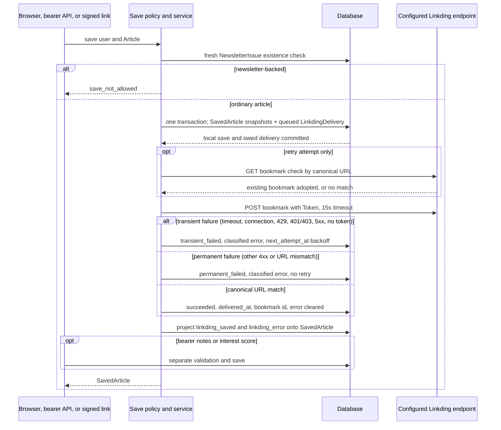

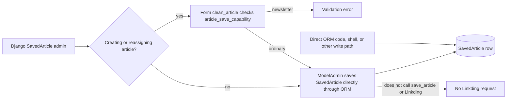

**[F]** Browser, bearer, and signed adapters use the save service. Local save intentionally survives Linkding failure. Re-save refreshes snapshots, restarts the delivery budget, and retries. Unsave deletes the local row, which cascades to its delivery and so cancels an owed bookmark; an already-delivered remote bookmark is never deleted. The configured URL defaults to HTTPS, but neither settings nor `save_to_linkding` enforces HTTPS.

**[F] Recoverable delivery.** A `LinkdingDelivery` row separates local save intent from remote progress, so a transient failure is retried instead of dropped. The save request makes the first attempt for immediate feedback; the refresh worker drains what remains owed each cycle, and `deliver_saved_articles` does the same on demand. Retries use exponential backoff (5 minutes doubling to a 6-hour cap) bounded by `LINKDING_MAX_DELIVERY_ATTEMPTS`, after which the delivery is recorded permanently failed rather than retried forever. A drainer claims a due row by compare-and-set on `next_attempt_at`, so a process that dies mid-attempt becomes due again rather than stranding the row, and a second drainer cannot repeat an attempt. Check constraints reject any state whose timestamps or error class disagree with it.

**[F] Verified remote contract.** A live-instance probe on 2026-08-17 confirmed the reconciliation endpoint: `GET /api/bookmarks/check/?url=` answers `200` with a `bookmark` object or `null` beside `metadata`/`auto_tags`, matches trailing-slash and host-case variants, does not match an added fragment, and answers `401` for a missing or bad token. The probe also established that `POST /api/bookmarks/` upserts by URL, so a retried create could not have duplicated a bookmark — it would instead have overwritten one the reader had edited, which is what adopting now prevents. Test fixtures carry the observed envelopes. The lookup is still written to be total, so an unavailable endpoint, transport error, unreadable body, or a bookmark for another URL degrade to creating; that is now a guard rather than a load-bearing assumption. There is still no circuit breaker, hostname allowlist, or remote delete.

**[D] Backfilled history.** Migration `0014` records existing confirmed saves as succeeded and everything else as permanently failed with error class `unknown`, deliberately not queueing a backlog of previously dropped bookmarks at deploy time. `deliver_saved_articles --requeue-failed` is the explicit opt-in to deliver them.

**[F] Admin bypass.** `SavedArticleAdminForm.clean_article` consults `article_save_capability` only when creating a row or reassigning its Article; it blocks a newsletter selection at that form layer. A normal admin save otherwise writes the model directly and does not call `save_article` or Linkding. Direct ORM/shell writes bypass even that form-layer capability check.

**[D] Failure boundary.** There is no transaction across service-driven local save, external POST and status update (nor should a DB transaction simply wrap remote I/O). A crash can leave ambiguous remote/local status. Bearer metadata is a second non-atomic phase.

### Newsletter webhook, render, and “open”

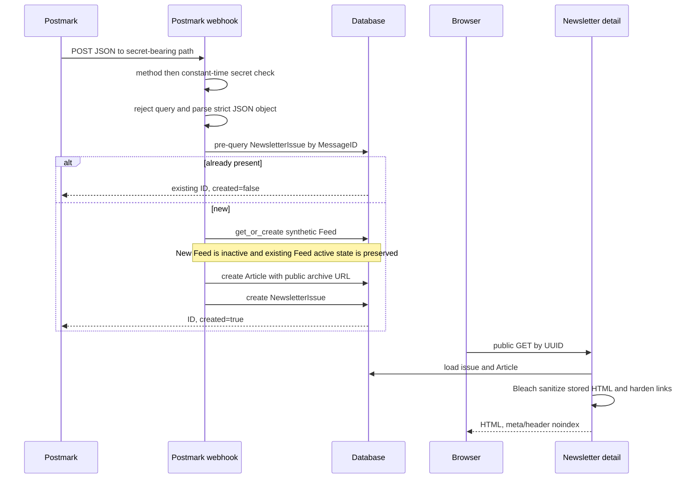

**[F]** The archive is public and UUID-addressed, not confidential. Sanitization strips disallowed content and gives links `_blank` plus `noopener noreferrer`; HTTP(S) images remain allowed and can contact remote tracking hosts. Text fallback is escaped by the template.

**[F]** “Open” means navigating to the public detail URL. There is no open-event model, pixel, counter, last-open timestamp, or analytics path.

**[D] Transaction boundary.** Synthetic Feed, Article and NewsletterIssue are not created atomically. Failure after Article insert can orphan it; retry can collide with article uniqueness rather than repair it.

### Bearer and signed API authorization

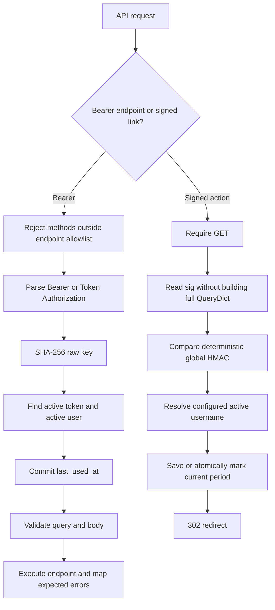

**[F]** Raw bearer tokens are not stored. Successful authentication updates `last_used_at` even if later validation or endpoint work fails; it is attempt-level, not success-level audit.

**[D]** Signed capabilities have no user binding in the signature, expiry, nonce, per-link record, revocation, or use audit. They mutate via GET and are susceptible to preview/prefetch/replay. Bearer tokens have no expiry or scopes; every active token can mutate global feeds/categories and trigger refresh.

### OPML import/export

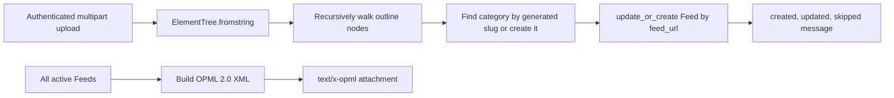

**[F]** Import parses the entire XML document before walking outlines, then updates title, site URL, category and active status. Export includes active feeds as flat outlines and omits category hierarchy; importing that export clears existing Feed categories, so category round trips are lossy. **[D]** Category lookup starts from a generated slug rather than unique name: an existing same-name category with a different slug can cause a duplicate-name `IntegrityError`. Malformed XML is not converted into form feedback and produces an error before any writes. Once valid XML parsing succeeds, a later category/feed processing failure can leave earlier writes committed because the loop has no encompassing transaction.

## 8. External trust boundaries and security controls

| Boundary | Current controls | Current gap / unknown |
| --- | --- | --- |
| Public client → Funnel → web | **[F]** TLS is documented as terminated by host Funnel; Docker publishes web only on loopback. Django trusts only `X-Forwarded-Proto=https`, enforces HTTPS redirect and secure session/CSRF cookies in production, validates allowed DNS hosts and exact HTTPS CSRF origins, denies framing, uses nosniff/same-origin referrer/opener. | **[F]** HSTS is intentionally zero. **[U]** Funnel config, ACLs, audience, rate limiting, certificate lifecycle, proxy logging/redaction and host firewall are outside the repo. |
| Session browser → mutation | **[F]** Django session auth and CSRF middleware/forms. Session cookie is HttpOnly, Secure in production, SameSite Lax. | **[D]** Posted `next` values are not same-origin validated on several handlers. Some read views do not explicitly reject non-GET methods. |
| Bearer client → API | **[F]** SHA-256 token lookup, active token/user checks, strict parsing, allowlisted fields/methods, normalized expected errors; TLS expected upstream. | **[D]** No scopes/expiry/rate limit. `last_used_at` is not operation-success audit. **[U]** Whether all users/tokens are intentionally administrator-equivalent. |
| Signed link → mutation | **[F]** HMAC-SHA256 and constant-time comparison; configured active username. | **[D]** Global deterministic, replayable, non-expiring mutating GET; URL query may leak in history/logs. |
| Postmark → webhook | **[F]** Secret path, constant-time compare before body validation, POST-only, CSRF exemption, no query, strict JSON, message ID uniqueness. | **[D]** No transaction/race-safe idempotency. No Postmark signature/header or source restriction. Path secret may enter upstream logs. **[U]** Upstream redaction/source controls. |
| Application → feed origins | **[F]** Credential-free absolute HTTP(S), ports 80/443, every resolved address must be global, redirect revalidation, environment proxies disabled, identity encoding, redirect/byte/connect/read/cooperative-total bounds, safe errors. | **[D]** Validation DNS and Requests connection DNS are separate (rebinding interval); total deadline cannot interrupt a socket call and slow drip can extend it. **[U]** Host egress policy. |
| Application → Linkding | **[F]** Configured URL with an HTTPS default, token header, JSON payload, 15-second Requests timeout, HTTP success and canonical returned-URL check; every failure is classified, persisted, and either retried with bounded backoff or terminated. A retry reconciles by canonical URL before creating, so a create whose response was lost is adopted rather than duplicated. | **[D]** HTTPS is not enforced: an operator can configure another scheme and the value reaches Requests without startup/service validation. There is still no hostname allowlist, circuit breaker, readiness check or remote delete, though the reconciliation endpoint's contract is now verified against the live instance. |
| Newsletter archive → remote content | **[F]** Bleach sanitization, restricted protocols/tags/attributes, link hardening, noindex. | **[I]** Allowed remote images disclose viewer network metadata to image hosts. No CSP/image proxy/click-to-load policy. |
| Processes → PostgreSQL | **[F]** Default Compose network with no published database port, credentials via environment, production rejects SQLite/incomplete/default development credentials; 600-second persistent connections. | **[F]** The network is not declared `internal`, so Compose does not prohibit egress. **[U]** Runtime role privilege, host/Docker security, database encryption and credential rotation history. |
| Secrets → runtime | **[F]** `.env` is gitignored; Compose injects ordinary environment variables. Values are not inventoried here. | **[F]** No SOPS/Vault/Docker secrets integration or repository rotation procedure. Environment/process inspection can expose values to privileged operators. |

## 9. Deployment and runtime topology

### Deployment view

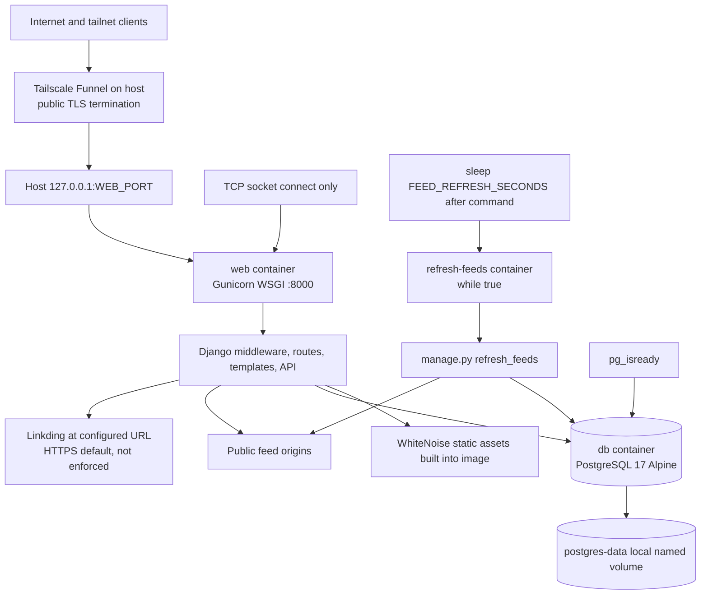

**[F]** Canonical production host is `daily-firehose`; checkout is `/home/ubuntu/daily-firehose`. Deployment is manual: fast-forward pull, start DB, build/run Django deploy checks, make a real DB connection, then rebuild/start the stack. Post-deploy commands inspect Compose/logs and exercise direct HTTP redirect, trusted proxy header, and public HTTPS. See [`AGENTS.md`](../../AGENTS.md).

**[F]** Startup order is DB healthy → web runs migrations then Gunicorn → TCP health → worker. Only web publishes a host port. Static files are collected during image build and served by WhiteNoise. The image uses Python 3.12 Bookworm slim and frozen production dependencies.

### Dated production observation

The following facts are bounded to an operator-verified observation on **2026-08-11**; they are not claims about continuous health or uninspected host configuration:

- **[F]** The canonical production checkout was deployed at revision `a0c62da2913078e0ac0e9e0fe1cfdd69e51a7823`, the same snapshot inventoried here.
- **[F]** Django reported migrations current with none pending, and the application-level PostgreSQL connectivity probe passed.
- **[F]** The `db` and `web` Compose health checks reported healthy. The `refresh-feeds` container was running and completed an observed cycle in which all 33 feeds succeeded, including Planet KDE; this is point-in-time functional evidence, not a durable worker healthcheck.
- **[F]** Public HTTPS through Tailscale Funnel was reachable. Direct loopback HTTP redirected to HTTPS, and the trusted `X-Forwarded-Proto: https` path produced the expected authenticated-application redirect behavior.
- **[F]** A Secure CSRF cookie attribute was observed through the production HTTPS path.

**[D]** Web startup automatically applies migrations. There is no backup/snapshot gate or separate migration job. Gunicorn has no repository-set worker count, request timeout, access log, graceful timeout, or max requests. No non-root `USER`, resource limits, read-only filesystem, image digest pinning, or custom network/egress policy is declared.

**[U]** Host provisioning, the stored Funnel/ACL/firewall configuration, image digest, CI/CD, Docker log policy, patching, disk monitoring, backups, monitoring/alerting, and Tailscale ACLs remain outside tracked evidence and were not established by the dated observation.

## 10. Configuration and secrets inventory

No values are shown. “Required” describes code/Compose behavior at this snapshot. A setting present in `.env` only reaches a container when Compose passes it.

| Variable | Required / default | Scope | Sensitivity | Invalid/missing behavior |
| --- | --- | --- | --- | --- |
| `DJANGO_ENV` | Direct default `development`; Compose app default `production`; exactly one of those | web, worker, direct CLI | low | Any other value aborts settings import. |
| `DJANGO_DEBUG` | Settings default `true`; Compose default `true`; production requires false | web, worker, direct CLI | low | Strict boolean parse; invalid or true-in-production aborts. Note Compose production default still fails closed until explicitly false. |
| `DJANGO_SECRET_KEY` | Development fallback; production explicit strong ≥50 chars with diversity | web, worker, direct CLI | **secret** | Production rejects missing, known development values/prefix and weak values. |
| `DJANGO_ALLOWED_HOSTS` | Development local/public defaults; production explicit CSV DNS names | web, worker | low | Production missing, IP-like, malformed, single-label or trailing-dot names abort. |
| `DJANGO_CSRF_TRUSTED_ORIGINS` | Development public HTTPS default; production explicit exact HTTPS origins | web, worker | low | Production missing, port/path/credentials/query/fragment, non-HTTPS or host mismatch abort. |
| `DATABASE_URL` | Optional alternative; no Compose pass-through | direct/non-Compose | **secret-bearing** | If set, takes precedence. Production requires complete PostgreSQL URL and non-development password; invalid aborts. |
| `POSTGRES_DB` | All five discrete fields required together; Compose interpolates empty by default | db, web, worker | low | Partial/missing production config aborts app; DB image also needs initialization values. |
| `POSTGRES_USER` | Required with discrete DB fields | db, web, worker | sensitive identifier | Same all-or-none/whitespace validation. |
| `POSTGRES_PASSWORD` | Required with discrete fields; no acceptable production default | db, web, worker | **secret** | Blank/whitespace-only or documented dev value in production aborts. Changing `.env` does not rotate existing volume role. |
| `POSTGRES_HOST` | Required with discrete fields; production example `db` | web, worker | low | Missing or surrounding whitespace aborts. |
| `POSTGRES_PORT` | Required; production example/default documentation 5432 | web, worker | low | Must be integer 1..65535 or settings import aborts. |
| `WEB_PORT` | Compose host-publish default 8000 | Compose host only | low | Invalid/busy port prevents container publication/start. Not read by Django. |
| `LINKDING_URL` | Configured endpoint; default is the documented HTTPS Linkding URL | web, worker; settings | sensitive topology | No startup scheme/host validation and HTTPS is not enforced; malformed, insecure, or unreachable configuration reaches Requests and fails or operates at save time. |
| `LINKDING_TOKEN` | Default empty; required only to save remotely | web, worker | **secret** | Startup succeeds; save persists local row and `LINKDING_TOKEN is not configured` failure. |
| `AGENT_LINK_SECRET` | Default empty | web, worker | **secret** | Signed routes return forbidden/not configured; no startup strength validation. |
| `AGENT_LINK_USERNAME` | Default empty | web, worker | sensitive identifier | Signed route returns 503 when no matching active user/configuration. |
| `POSTMARK_INBOUND_SECRET` | Default empty; passed to web only | web | **secret** | Web starts; all webhook calls return 403 if absent/mismatched. |
| `POSTMARK_INBOUND_EMAIL` | Default provider-generated inbound identifier; passed to web | web/UI | sensitive routing address | Missing environment uses default; displayed on Feeds page. Worker does not need it. |
| `FEED_REFRESH_SECONDS` | Compose worker default 3600 | worker shell only | low | Shell uses default when unset; nonnumeric/negative behavior is shell `sleep` failure/restart-loop dependent, not settings-validated. |
| `FEED_FETCH_CONNECT_TIMEOUT_SECONDS` | Default 5 | web, worker, direct settings | low | Must parse as float; nonpositive or non-finite values parse but the fetch policy rejects them at use. |
| `FEED_FETCH_READ_TIMEOUT_SECONDS` | Default 20 | web, worker, direct settings | low | Same nonpositive/non-finite rejection at fetch time. |
| `FEED_FETCH_TOTAL_TIMEOUT_SECONDS` | Default 60 | web, worker, direct settings | low | Same nonpositive/non-finite rejection; cooperative, not a hard process deadline. |
| `FEED_FETCH_MAX_BYTES` | Default 5,000,000 | web, worker, direct settings | low | Must parse int; nonpositive rejected when fetching. |
| `FEED_FETCH_MAX_REDIRECTS` | Default 3 | web, worker, direct settings | low | Must parse int; negative rejected when fetching. |
| `FEED_REFRESH_LOG_LEVEL` | Settings default `INFO` | any Django process if environment reaches it | low | **[D]** Not in `.env.example` and not passed by canonical Compose, so `.env` alone cannot configure it. Invalid logging level may fail logging configuration during startup. |
| `DJANGO_SETTINGS_MODULE` | Set to `daily_firehose.settings` by manage.py/WSGI/ASGI entrypoints | process bootstrap | low | Wrong module prevents Django startup. Not operator-facing in `.env.example`. |
| `PYTHONDONTWRITEBYTECODE` | Image-fixed `1` | image processes | low | Not operator configuration in canonical image. |
| `PYTHONUNBUFFERED` | Image-fixed `1` | image processes | low | Not operator configuration; ensures prompt console output. |
| `PATH` | Image prepends `/app/.venv/bin` | image processes | low | Image/runtime failure if altered incompatibly. |

**[F]** `DATA_UPLOAD_MAX_MEMORY_SIZE` and `DATA_UPLOAD_MAX_NUMBER_FIELDS` are not overridden; Django defaults therefore govern request parsing. **[U]** Production secret values, `.env` permissions, and rotation history were not inspected or recorded.

## 11. Observability, health, readiness, backup, and recovery

| Capability | Current inventory | Assessment |
| --- | --- | --- |
| Application logging | Feed service emits bounded/sanitized single-line completion logs with feed ID/title, status, duration, counts or error code, failure count and retry time; unexpected errors include traceback. Command emits human-readable results. Python is unbuffered. | **[F]** Console-only. Compose declares no driver, rotation, retention or aggregation. Gunicorn access logging is not configured. |
| Metrics/tracing/errors | No first-party metrics endpoint/exporter, tracing, Sentry/error collector, dashboard or alert rules in dependencies/config. | **[U]** External host monitoring may exist; none is evidenced. |
| DB liveness | Compose `pg_isready` every 10s, 5 retries. Deployment also performs one real Django DB connection probe. | **[F]** Startup/liveness only; no ongoing capacity, replication, query, disk or data-integrity signal. |
| Web health | Compose opens TCP connection to loopback:8000. Post-deploy curls verify redirect/auth boundary manually. | **[D]** TCP accepts do not prove HTTP, DB availability, migrations, auth or semantic readiness. Manual curls are not an automated health gate. |
| Worker health/freshness | Restart policy; per-feed timestamps/failure/backoff rows; logs and command summaries. | **[D] High.** No worker healthcheck, refresh-run row, heartbeat, stale threshold, watchdog or alert. An `Up` worker can be stale. This failure mode caused the linked multi-day incident. |
| Refresh exit semantics | Command continues after each classified failure and prints aggregate warning. | **[D]** Command exits successfully even when all/part of the cycle failed; supervision cannot use exit status. |
| Storage durability | One local Docker named volume `postgres-data`; normal deployment preserves it. | **[D] Critical.** Single-host failure domain. A named volume is persistence, not a backup. |
| Backup | README mentions restoring a “known-good database backup” for schema rollback. | **[D] Critical.** No creation command, schedule, destination/off-host copy, encryption, retention, integrity check, RPO/RTO or restore drill is defined; existence of any backup is unknown. |
| Credential recovery | README documents DB-only startup, connectivity probe, restoring prior `.env`, or interactive `psql \password` without exposing password in command history. | **[F]** Preserves volume and stops before app restart on mismatch. |
| App rollback | Checkout known-good code and rebuild while preserving `.env`/volumes. | **[F]** Code rollback only. Schema/data rollback requires migration-specific verified reversal or a real backup restore. Auto-migrations raise risk. |

The incident document is historical evidence and partly stale as a current description: bounded feed fetching, per-feed failure isolation, and per-feed health fields now exist. Its required worker heartbeat/freshness health and several operational gates do **not** exist, so the incident must not be read as fully resolved.

## 12. Production versus test seams and unknowns

### Evidenced seams

- **[F] Database:** direct development defaults to SQLite; canonical production requires PostgreSQL. Most tests use Django's default test DB path and cannot prove PostgreSQL NULL uniqueness, locks, isolation, or concurrency.
- **[F] HTTP:** feed tests inject policy and Requests-compatible doubles; refresh tests separate fetched bytes from parser. Linkding/Postmark use fixtures/mocks. Live DNS/TLS/external provider semantics are not exercised by the unit suite.
- **[F] Time:** Django timezone helpers are patched/controlled in tests; production is UTC. Today means UTC local date and uses fetch date.
- **[F] Browser:** Playwright tests responsive behavior, but browser installation is an external prerequisite and screenshots are generated only on failures.
- **[F] Settings:** production settings tests use subprocess/environment isolation to exercise import-time failures. They do not inspect the live `.env`.
- **[F] Known defects:** eight `expectedFailure` tests let the full suite pass while confirmed defects remain.
- **[F] Pre-commit:** only YAML validity, EOF, and trailing whitespace checks run. It is not a test, type, Markdown, Mermaid or architecture validation gate.

### Production observations and remaining unknowns

- **[F]** The dated section 9 observation establishes the deployed revision, current migration state, DB connectivity, healthy DB/web checks, a running worker with one successful 33-feed cycle, public HTTPS/proxy behavior, and a Secure CSRF cookie only at the observed time.
- **[U]** The deployed image digest, Postmark delivery, Linkding reachability, and behavior after that observation were not established.
- **[U]** Stored Funnel configuration, ACLs, webhook URL redaction, host firewall and network egress controls are not in the repository and were not inspected; only the public/proxy behavior above was observed.
- **[U]** Off-host backup/snapshot, monitoring, alerting, Docker log rotation, disk/capacity management and restore drills may or may not exist outside the repository.
- **[U]** Whether the product assumes one trusted owner or multiple mutually untrusted accounts is not encoded. Models are user-scoped for state, but Feed/Category and refresh authority are global and every bearer token has that authority.
- **[U]** Public newsletter remote-image privacy policy is not recorded beyond the implemented allowlist.

## 13. Evidence-linked hotspot and risk register

| Severity | Status | Hotspot/risk | Evidence and impact |
| --- | --- | --- | --- |
| Critical | **[D]** | No evidenced backups | [`docker-compose.yml`](../../docker-compose.yml) defines one local volume; [`README.md`](../../README.md) references an unspecified backup. Host loss or destructive migration may be unrecoverable. |
| High | **[D]** | Newsletter ingestion non-atomic | [`feeds/services.py`](../../feeds/services.py) creates Feed/Article/Issue separately; `test_known_correctness_failures.py` characterizes orphaning. Retry may be permanently conflicted. |
| High | **[D]** | Synchronous slow work in web process | Browser/API refresh, feed discovery and Linkding run external calls inline; Compose uses untuned Gunicorn defaults. A long refresh can consume serving capacity. |
| High | **[D]** | Concurrent refresh has no ownership | Eligibility is unlocked; only failure update locks. Worker/UI/API overlap can duplicate work and stale failure can overwrite newer status. |
| High | **[D]** | Worker freshness invisible | No heartbeat/healthcheck/alert; [incident](../incidents/2026-08-11-mobile-today-empty.md) records an `Up` but multi-day-stuck worker. |
| High | **[D]** | Reversed adapter dependency | [`feeds/api.py`](../../feeds/api.py) imports private browser helpers; URLconf dynamically imports API. Domain/query behavior is coupled to presentation. |
| High | **[D]** | Migration/rollback safety | Web boot runs migrations automatically; no backup gate or migration-specific rollback playbook. |
| Medium | **[D]** | Bulk marker invalid/duplicate states | Nullable composite uniqueness is ineffective for logical NULL-shaped keys in PostgreSQL; no shape/order checks; expected-failure tests exist. Reads may error or diverge. |
| Medium | **[D]** | Article GUID/URL identity conflict | Refresh upserts by GUID while URL is separately unique; same URL/new GUID fails entire feed transaction. |
| Medium | **[D]** | Open redirects | Several browser mutations redirect unvalidated posted `next`; expected-failure characterization exists. |
| Medium | **[D]** | Replayable mutating GETs | Signed HMAC actions lack expiry/nonce/audit and GET may be invoked by scanners, prefetchers or replay. |
| Medium | **[D]** | SSRF residual seams | DNS validation is not connection pinning; total timeout is cooperative. README explicitly requires egress/watchdog controls not present in Compose. |
| Medium | **[D]** | Read path scales marker×article | Python nested evaluation, `__date` filtering, no dedicated fetched-time index, unpaginated arbitrary API windows. Latency/memory grow with data. |
| Medium | **[D]** | Save consistency/remote ambiguity | Local-first then external then status; no idempotency/outbox. Crashes can misstate remote result; API metadata is separate. |
| Medium | **[D]** | OPML error handling and partial valid import | Malformed XML escapes as an error before writes; after valid parsing, later outline-processing failure can leave prior incremental writes committed because no transaction surrounds the loop. |
| Medium | **[D]** | Authorization assumption unencoded | Tokens lack scopes/expiry and can mutate global resources. Risk depends on unresolved single-owner/multi-user policy. |
| Medium | **[D]** | Console-only observability | No metrics/traces/collector/retention/alerts, and partial refresh failure exits zero. |
| Medium | **[D]** | Canonical log-level configuration gap | `FEED_REFRESH_LOG_LEVEL` is read but not documented/passed by Compose. |
| Medium | **[I]** | Public newsletter remote-image tracking | Sanitizer permits HTTP(S) image sources; opening can disclose client metadata. Desired privacy policy is unknown. |
| Low | **[F] accepted/deferred** | HSTS disabled | Explicit `SECURE_HSTS_SECONDS=0`; only security.W004 is silenced. Downgrade resistance depends on current entry path. |
| Low | **[D]** | Dead Today template and duplicated orchestration | Drift can mislead maintenance and let adapter contracts diverge. |
| Low | **[F]** | Open observability absent | No newsletter open-event persistence; do not infer readership from archive presence. |

## 14. Dependency-ordered incremental refactor roadmap

Everything in this section is **[R] recommendation**, not implemented capability. Use expand-contract changes and preserve current public behavior until an explicit compatibility decision. **Phase 0 is a hard prerequisite for Phase 1 repairs and every destructive cleanup or constraint migration; no later phase may substitute for its verified backup/restore gate.**

### Phase 0 — establish safety gates, contracts, and operational stopgaps

- Create an encrypted off-host PostgreSQL backup process, define RPO/RTO and retention, verify backup integrity, and complete a timed restore drill into an isolated database. Record only procedure/results and secret names, never credentials.
- Introduce PostgreSQL CI now, including migration application and DB-specific constraint/concurrency tests; later phases extend this existing job rather than introducing it again.
- Add a no-schema stale-refresh watchdog/alert stopgap using current feed timestamps, command completion, and container state while durable refresh-run heartbeat work remains in Phases 4–5. Define an operator-approved stale threshold, exercise alert fire/recovery, and observe it for at least three scheduled refresh cycles.
- Define and implement refresh command exit semantics so attempted feed failures return nonzero without losing per-feed continuation/results. Document `FEED_REFRESH_LOG_LEVEL` in `.env.example` and pass it through the canonical Compose services.
- Investigate Linkding's create/idempotency contract before designing retries: verify whether an idempotency key or URL-level upsert exists and define the required outcome for timeout/lost-response ambiguity when remote success cannot be observed.
- Record ADRs for single-owner versus multi-user authorization, public newsletter/image privacy, canonical Article identity, and synchronous/signed-route compatibility.
- Add contract snapshots for browser redirects, API envelopes, refresh summaries/exit status, read visibility, newsletter dedupe/render and OPML errors.
- **Migration:** no application schema change; operational backup/restore assets, CI, watchdog, command behavior, documentation and Compose configuration change first.
- **Compatibility:** endpoint/schema behavior remains unchanged. Announce the nonzero command contract to any external automation and stage the watchdog threshold to avoid false alerts.
- **Observability:** establish baseline request/refresh durations, result counts, stale-feed age, query count, legacy signed-route usage, backup age/result, restore duration, and watchdog state.
- **Rollback:** retain the verified backup regardless of code rollback; command/Compose/watchdog changes are independently reversible, and alert disablement must not delete evidence.
- **Acceptance gate:** a restorable encrypted off-host backup and timed restore drill meet documented RPO/RTO; PostgreSQL CI is required and green; the watchdog fires and clears in a test and remains correctly healthy across at least three scheduled production cycles; attempted refresh failure produces nonzero while later feeds still run; Compose delivers the documented log level; Linkding lost-response behavior and all four ADR decisions are recorded; the existing suite remains green with known failures enumerated.

### Phase 1 — repair confirmed correctness and browser security defects

- Centralize same-origin `next` resolution.
- Make newsletter import one atomic, race-idempotent use case and repair/detect existing orphan Articles.
- Define and implement deterministic feed GUID/URL reconciliation.
- Convert malformed OPML to form/API errors and make import atomic.
- **Migration:** optional forward-only data repair command for newsletter orphans; no destructive schema required.
- **Compatibility:** preserve paths, status/envelope shapes and successful OPML semantics.
- **Observability:** count rejected redirects, newsletter dedupe/race outcomes, repaired orphans, identity reconciliations and OPML rollback errors.
- **Rollback:** code rollback safe if repair output remains schema-compatible; retain repair audit/output.
- **Acceptance gate:** corresponding expected failures become ordinary passing tests; no regression in existing adapters; concurrency test proves one issue per message.

### Phase 2 — repair and simplify read persistence

- Reconfirm the Phase 0 backup/restore gate, then audit and deduplicate malformed/duplicate `BulkReadMarker` rows.
- Centralize scope, feed/date shape, required-field, and ordered-date validation in one application command used by browser, bearer, and signed adapters.
- Make both browser bulk operations use the same atomic materialize-state-plus-marker transaction already expected from API/signed operations; one write failure must roll back both halves.
- Add scope-shape, ordered-date and conditional uniqueness constraints for PostgreSQL.
- Decide `ArticleReadState` as canonical visibility state; retain markers initially as validated audit/cutoff records, dual-read/compare before removing marker evaluation.
- **Migration:** expand with constraints only after backup verification, dry-run cleanup, and an audited dedupe; use conditional unique/check constraints and a reversible compatibility release.
- **Compatibility:** keep current valid request shapes and visible/read IDs stable; malformed, missing, and reversed date input changes from server error/invalid persistence to a consistent validation response.
- **Observability:** mismatch counter between old/new read computation; duplicate/invalid cleanup report; validation failures; transaction rollback count; operation rows/duration.
- **Rollback:** keep old reader behind a flag for one release; dropping constraints does not restore deleted duplicates, so preserve the Phase 0 backup plus cleanup export/audit.
- **Acceptance gate:** PostgreSQL concurrent writes produce one logical marker; invalid shapes fail in DB; browser/API/signed adapters share validation; malformed/missing/reversed dates are tested; injected marker-write failure proves explicit-state rows roll back; representative snapshot returns identical visible Article IDs.

### Phase 3 — establish application boundaries without changing APIs

- Extract article windows/queries/read-state commands below both adapters.
- Split refresh orchestration, newsletter import, saving/Linkding and preference commands into narrow modules/interfaces.
- Introduce explicit clock, feed-fetch, Linkding and transaction seams; keep Django endpoints thin.
- **Migration:** none.
- **Compatibility:** URL names, methods, templates, redirects and JSON remain unchanged.
- **Observability:** compare response/query counts and operation summaries before/after.
- **Rollback:** module refactor is code-only; old adapters can be restored.
- **Acceptance gate:** `api.py` imports no private `views` symbols; characterization/browser tests and mypy pass; no query-count regression.

### Phase 4 — add refresh ownership and contract-aware integration recovery

- Add refresh-run records plus per-feed lease/fencing ownership; only the active owner may commit status. Replace, rather than remove prematurely, the Phase 0 stale watchdog signal with durable run heartbeat data.
- Implement Linkding recovery according to the Phase 0 contract finding: use provider idempotency/upsert keys if verified; otherwise use a durable outbox plus explicit ambiguous/lost-response reconciliation and do not promise an impossible exactly-once remote effect.
- **Migration:** additive nullable run/lease/outbox tables or fields; deploy old-code-compatible schema before enabling claims.
- **Compatibility:** current refresh endpoints may initially block on the same service but expose unchanged result fields; save response remains local-first and exposes a defined ambiguous state if required by provider limitations.
- **Observability:** run start/heartbeat/finish, lease contention/loss, stale-run count, side-effect attempt/key/reconciliation/ambiguity result.
- **Rollback:** feature flag disables coordination; old code must tolerate additive schema; preserve idempotency and reconciliation records across versions.
- **Acceptance gate:** competing PostgreSQL workers show one owner and stale failures cannot overwrite newer success. If Linkding supports verified idempotency/upsert, retries produce at most one logical bookmark; otherwise lost-response tests preserve an auditable ambiguous state and reconciliation follows the Phase 0 contract without blind duplicate retries.

### Phase 5 — move slow work out of HTTP

- Use a durable database-backed job/outbox path before adding another infrastructure dependency.
- Make refresh/discovery/integration requests enqueue bounded work and return accepted/status contracts; worker resumes/reclaims safely after restart.
- Explicitly configure Gunicorn workers/timeouts and request-level rate limits as defense in depth.
- **Migration:** additive jobs table and status columns; backfill not required; deploy producer/consumer compatibility in stages.
- **Compatibility:** version or negotiate synchronous-to-202 changes; keep old operator-only synchronous behavior behind a bounded temporary flag and publish deprecation.
- **Observability:** queue depth/age, job heartbeat, attempts, dead letters, request latency, worker freshness endpoint/healthcheck.
- **Rollback:** stop producers, drain or safely reclaim jobs, then switch feature flag; never discard ambiguous external jobs.
- **Acceptance gate:** hanging feed does not delay concurrent page/webhook; worker restart recovers jobs; stale job makes health unhealthy; clients pass compatibility tests.

### Phase 6 — optimize read/query paths

- Before optimization, record the production-sized fixture's exact Article, marker, state, user, feed, and date-window cardinalities; set a numeric maximum query count and numeric p95 latency threshold for each benchmarked surface.
- Replace `fetched_at__date` with timezone-aware half-open timestamps.
- Add indexes only from PostgreSQL `EXPLAIN (ANALYZE, BUFFERS)` evidence.
- Paginate/cap API windows and eliminate marker×article Python evaluation after dual-read confidence.
- **Migration:** additive concurrent indexes where warranted; contract/version plan for pagination limits.
- **Compatibility:** preserve ordering and Article ID sets; offer bounded transition for API pagination.
- **Observability:** p50/p95 latency, query count, rows examined, memory, plan fingerprints and pagination adoption.
- **Rollback:** indexes can remain harmlessly; retain prior reader/pagination compatibility flag for one release.
- **Acceptance gate:** the recorded-cardinality fixture stays at or below the work plan's numeric query-count maximum and p95 latency threshold, uses the intended index plans, and preserves identical pre-pagination result ordering.

### Phase 7 — harden external trust and mature operations

- Replace signed mutating GET with expiring, purpose/user-bound, one-use POST capabilities; support bounded deprecation then return 410 for old routes.
- Verify Postmark's supported authentication capabilities first. If signed/header verification exists, add and rotate it; otherwise implement zero-downtime rotating path/header secrets plus ingress allowlisting/rate controls where available. In either case, choose a canonical archive origin rather than deriving it from each request.
- Apply host/network egress controls and decide CSP/remote-image policy.
- Mature the Phase 0 backup foundation with scheduled retention/integrity monitoring and recurring restore drills; separate migration preflight/application from web startup.
- Extend the existing PostgreSQL CI coverage, and add HTTP/DB semantic readiness, durable worker freshness health, log retention, metrics and alerts.
- **Migration:** additive capability-use/webhook-auth state and expand-contract auth rollout; the Phase 0 operational backup gate remains mandatory before destructive changes.
- **Compatibility:** instrument old signed/webhook auth, accept old+new during a dated window, then remove deliberately; preserve a provider-capability fallback.
- **Observability:** capability replay/expiry failures, webhook auth mode/version, egress denials, backup age/result, restore duration, readiness/freshness SLOs.
- **Rollback:** preserve dual auth during rollout; capability state and idempotency records survive code rollback; migration rollback is plan-specific, never just a checkout.
- **Acceptance gate:** replay/expiry tests fail safely; the verified Postmark authentication mode rotates without downtime; rebinding/egress tests pass; recurring restore drills continue meeting documented RPO/RTO; durable readiness/freshness signals remain healthy over multiple cycles.

## 15. Architecture acceptance checklist

- **[F]** Every tracked first-party runtime Python module, migration, command, admin/form layer, template/static source, test module and fixture/support role is accounted for above.
- **[F]** Tracked build/operator/documentation artifacts in scope—including ignore files, Python version selection, lock/config files, screenshot and incident/plan documents—are inventoried; production-image exclusion of tests is explicit.
- **[F]** Every first-party URL declaration is mapped; Django-provided auth/admin prefixes are identified as framework-owned expansion points.
- **[F]** All nine application models, fields, relationships, constraints, deletion behavior, ordering and timestamp meanings are documented.
- **[F]** Required data flows, transaction/failure boundaries, trust boundaries, deployment topology, configuration names, operational inventory and test seams are explicit.
- **[F]** Defects, inferences, unknowns and recommendations are visibly distinct. Deferred roadmap work is not represented as current functionality.
